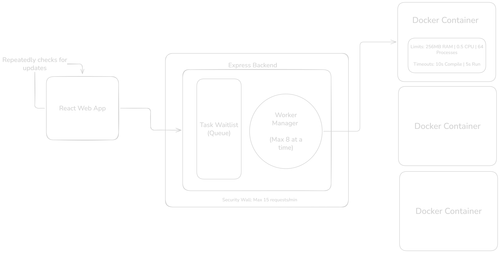
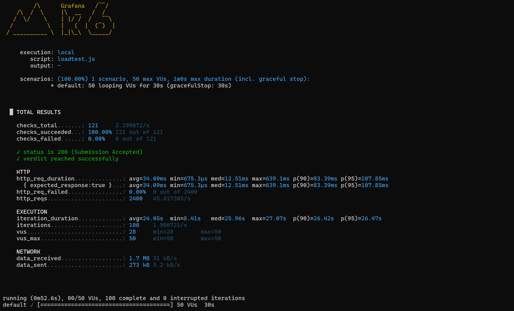

# Secure Remote Code Execution (RCE) Engine & Online Judge Core

A highly resilient, defensively engineered asynchronous code execution platform designed to securely compile and evaluate untrusted user-submitted C++ binaries under intense concurrent load. This system eliminates standard online judge failure states—such as infinite compilation loops, thread exhaustion fork bombs, memory bloat, and API flooding—through strict kernel-level sandboxing and stateful backpressure management.

---

## Technical Architecture & Lifecycle Topology

The platform separates the user-facing web layers from the compute nodes using a stateful, asynchronous control-plane pattern. This prevents untrusted user computations from blocking the primary Node.js event loop or saturating host machine resources.



### Request Lifecycle
1. **Ingress Filtering:** The client submits a payload containing source code. The request passes through a proxy-aware network defense layer enforcing rate limits.
2. **Backpressure Admittance:** Validated tasks are immediately assigned a unique UUID and enqueued into a bounded FIFO memory array. The Express controller instantly responds to the client with a `200 Accepted` status and the `submissionId`, dropping the connection footprint to zero.
3. **Decoupled Client Polling:** The client orchestrates sequential status verification queries via recursive macro-task intervals, eliminating HTTP request stacking.
4. **Worker Allocation & Container Lifecycle:** A background worker pool monitor picks up pending items, creates an isolated temporary workspace on the OS filesystem, mounts the directory into a sandboxed Docker container, enforces hardware resource limits, runs kernel-level timeout monitors, and saves parsed execution outputs to MongoDB.

---

## Hardened Sandbox Security & Threat Mitigation Matrix

To evaluate untrusted user code safely without risking host environment compromise, the system implements a multi-layered sandbox security profile enforced directly via Linux cgroups, namespaces, and core utilities:

| Vector / Attack Profile | Vulnerability Mechanism | Architectural Mitigation & Enforcement |
| :--- | :--- | :--- |
| **Fork Bomb** | Infinite process spawning (`while(1) fork();`) to exhaust host PID tables. | Enforced strict process restriction via `--pids-limit=64` inside the Docker runtime flag configuration. |
| **Memory Exhaustion** | Arbitrary heap allocation arrays to trigger host Out-of-Memory (OOM) panics. | Hard-capped container memory boundaries using `--memory="256m"`. |
| **CPU Starvation** | Unbounded loops (`while(true);`) hogging the server's execution threads. | Restricted physical core allocation via `--cpus="0.5"`. |
| **Compile-Time Hanging** | C++ template metaprogramming tricks designed to lock the compiler in a loop. | Isolated the build pipeline via a nested containerized shell executing `timeout 10 g++`. |
| **Runtime Infinite Loop** | Code that compiles successfully but hangs during execution. | Wrapped binary invocation via kernel-level utility `timeout 5 ./main`, trapping Exit Code `124`. |
| **Output Buffering / DOS** | Infinite standard output generation (`while(1) cout << "A";`) to exhaust RAM. | Capped Node.js child process buffering using a strict `maxBuffer: 1024 * 64` (64KB) limit. |
| **Network Exfiltration** | Malicious binaries attempting SSRF or connecting to external command & control servers. | Severed all external networking bridges by configuring `--network none`. |
| **API Denial of Service** | Scripted payload floods hitting the server to overwhelm the task pipeline. | Applied proxy-aware rate-limiting filters restricting clients to 15 submissions per minute. |

---

## Empirical Performance Profile & Benchmarking

To prove the operational stability of the bounded worker queue and verify resource throttling behaviors under load, the system was subjected to a high-stress benchmarking suite using **k6**.



### Load Profile & Parameters
* **Concurrent Load:** 50 Virtual Users (VUs) continuously executing overlapping submission workflows.
* **Test Duration:** 30 seconds.
* **Total Transaction Volume:** 2,400 distinct HTTP operations generated.

### Metrics & System Observability Summary

| Performance Metric | Captured Value | Operational Significance |
| :--- | :--- | :--- |
| **HTTP Request Failure Rate** | **0.00%** | Absolute platform reliability under intense spikes. Zero connections dropped. |
| **API Ingress Latency (p95)** | **107.85ms** | Proves the Node.js event loop remained fully unblocked and responsive during full load. |
| **Average Ingress Latency (med)**| **12.51ms** | Demonstrates highly efficient, low-overhead transaction ingestion. |
| **Average Verdict Resolution Time** | **24.05s** | Represents expected, controlled degradation via structural queuing. |

### Architectural Takeaway
During peak traffic conditions where 50 users simultaneously hit the compilation system, a naive application architecture would suffer catastrophic failure due to host process starvation. By restricting the active container concurrency and using an internal backlog queue, this platform successfully absorbed the spike, degraded gracefully by stretching resolution wait times, maintained sub-110ms API interactive response curves, and recovered completely with zero data corruption or unhandled runtime faults.

---

## Local Development & Environment Seeding

### Prerequisites
* Node.js (v18+ recommended)
* MongoDB (Running locally or accessible via a valid connection string)
* Docker Desktop (Must be running with Linux containers enabled)

### Quick Start Installation

1. **Clone and Install Dependencies:**
   ```bash
   git clone https://github.com/taarumgarud/mini-judge
   cd mini-judge
   
   # Setup Backend
   cd backend && npm install
   
   # Setup Frontend
   cd ../frontend && npm install

2. **Initialize and Seed the Database:**
   cd ../backend
   node seed.js

3. **Launch the Infrastructure:**
   # Start the Backend Control Pane
   node server.js

   #Launch the Frontend IDE Interface
   cd ../frontend
   npm run dev